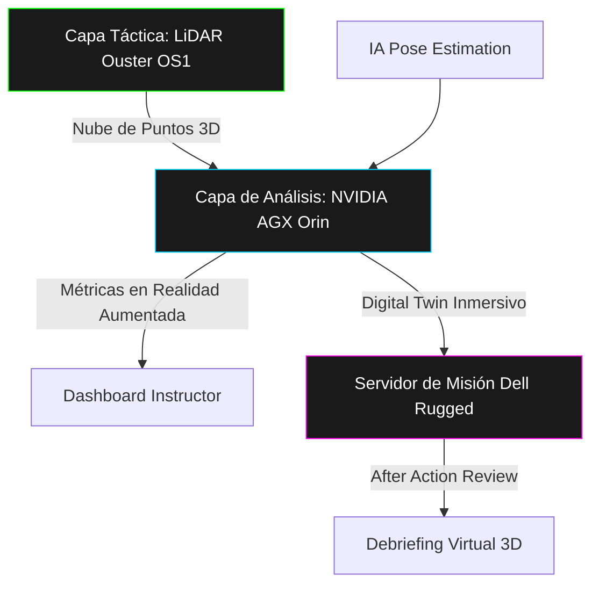
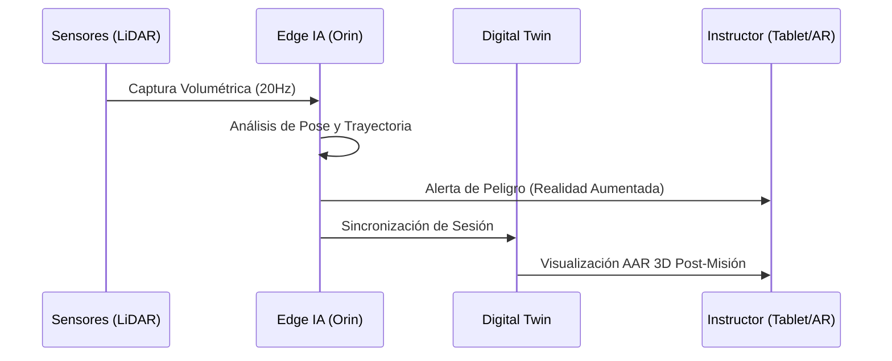

# GHOST-SIGHT: IA Táctica y Conciencia Volumétrica 3D

**GHOST-SIGHT (Global Hostile Operational Surveillance & Tactical AI)** es la plataforma definitiva de digitalización táctica para unidades de élite. Transformamos el adiestramiento CQC (Close Quarters Combat) de una evaluación subjetiva a una ciencia basada en datos objetivos mediante LiDAR de estado sólido e IA en el borde.

---

## 👁️ Visión General
GHOST-SIGHT resuelve el "punto ciego" del análisis táctico, proporcionando una reconstrucción volumétrica milimétrica de cada movimiento, disparo y cobertura, incluso en condiciones de visibilidad cero.

> [!IMPORTANT]
> **Propósito Dual:** Diseñado para la defensa nacional y la seguridad interna, con total interoperabilidad bajo estándares OTAN.

---

## 🏗️ Arquitectura del Sistema

---

## 🎯 Capacidades Críticas
- **🛡️ Disciplina de Cañón (Muzzle Sweep):** Alertas instantáneas (<100ms) si un cañón cruza la silueta de un aliado.
- **⚡ Velocidad de Entrada (Breach Velocity):** Medición de aceleración y fluidez en el asalto.
- **📉 Exposición Volumétrica:** Cálculo exacto de cuánta superficie corporal fue visible desde ángulos enemigos.
- **🌫️ Operación en Humo/0-Lux:** El LiDAR crea un mapa perfecto donde las cámaras convencionales fallan.

---

## 🗺️ Despliegue en Unidades Tier 1 (España)

| Unidad | Sede de Excelencia | Foco Estratégico |
| :--- | :--- | :--- |
| **MOE** | 🇪🇸 Alicante (Rabasa) | Operaciones Especiales de alta intensidad. |
| **GAR** | 🇪🇸 Logroño (PEFE) | Contraterrorismo y combate urbano/híbrido. |
| **GEO** | 🇪🇸 Guadalajara | Protección de altas personalidades y asaltos críticos. |
| **FGNE** | 🇪🇸 Cartagena | Guerra Naval Especial y abordajes (MIO). |
| **EMMOE** | 🇪🇸 Jaca | Investigación biomecánica y formación avanzada. |

---

## 🔄 Ciclo de Vida del Proyecto

---

## 🌍 Alineación Estratégica: NATO DIANA
GHOST-SIGHT participa activamente en el acelerador **NATO DIANA**, promoviendo la estandarización de los "Gemelos Digitales Tácticos" para permitir la interoperabilidad federada (FMN Spiral 4) entre naciones aliadas.

---
**Timestamp:** 2026-01-31
**Nivel de Seguridad:** Confidencial GHOST-SIGHT
**Desarrollado con:** 💻 [Vibecoding](https://github.com/topics/vibecoding) & Antigravity AI
